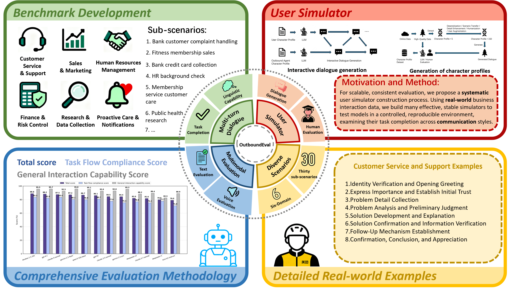
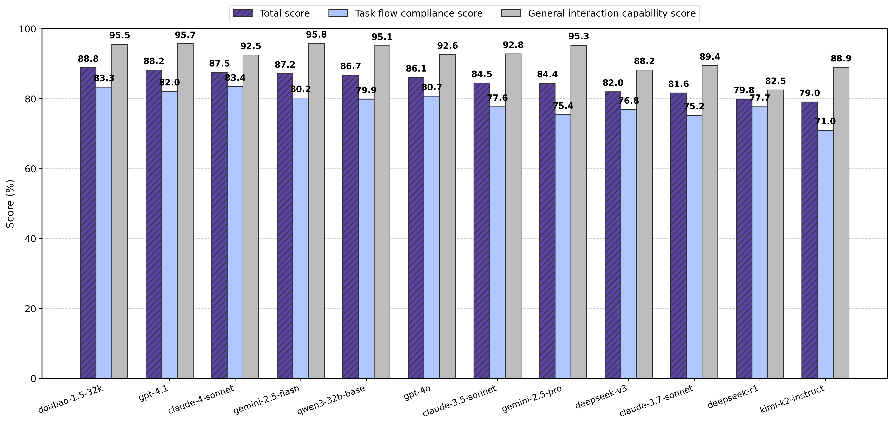

<h2>OutboundEval: A Dual-Dimensional Benchmark for Expert-Level Intelligent Outbound Evaluation of Xbench's Professional-Aligned Series</h2>

  <!-- arxiv badges -->
  
  <!-- Chinese Version -->
  
  <!-- Github -->
  

  

    <a>Pengyu Xu</a>1,4*, 
    <a>Shijia Li</a>1,5*, 
    <a>Ao Sun</a>1,6*,
    <a>Yahan Li</a>1,7, 
    <a>Bo Wu</a>1,8,
    <a>Zhanyu Ma</a>1,  
    <a>Jiguo Li</a>1,
    <a>Jun Xu</a>1,
    <a>Jiuchong Gao</a>1,
    <a>Jinghua Hao</a>1,
    <a>Renqing He</a>1,
    <a>Rui Wang</a>2,
    <a>Yang Liu</a>2,
    <a>Xiaobo Hu</a>2,
    <a>Xbench</a>2,
    <a>Fan Yang</a>3,
    <a>Jia Zheng</a>3,
    <a>Guanghua Yao</a>3,
  

  

    1<a>Meituan</a>, 2<a>Xbench</a>, 3<a>Agora</a>, 4<a>Beijing Jiaotong University</a>,  
    5<a>BUPT</a>, 6<a>The Chinese University of Hong Kong, Shenzhen</a>, 7<a>Jilin University</a>, 8<a>Peking University</a>
  

<small>*Equal Contribution.</small>

# OutboundEval

## 🤖 Introduction
Welcome to the GitHub repository for our paper titled "OutboundEval: A Dual-Dimensional Benchmark for Expert-Level Intelligent Outbound Evaluation of Xbench's Professional-Aligned Series". 
In this work, we propose **OutboundEval**, a comprehensive benchmark for evaluating large language models (LLMs) in expert-level intelligent outbound calling scenarios. Unlike existing methods that suffer from three key limitations—insufficient dataset diversity and category coverage, unrealistic user simulation, and inaccurate evaluation metrics—OutboundEval addresses these issues through a structured framework. First, we design a benchmark spanning six major business domains and 30 representative sub-scenarios, each with scenario-specific process decomposition, weighted scoring, and domain-adaptive metrics. Second, we develop a large-model-driven **User Simulator** that generates diverse, persona-rich virtual users with realistic behaviors, emotional variability, and communication styles, providing a controlled yet authentic testing environment. Third, we introduce a dynamic evaluation method that adapts to task variations, integrating automated and human-in-the-loop assessment to measure task execution accuracy, professional knowledge application, adaptability, and user experience quality. Experiments on 12 state-of-the-art LLMs reveal distinct trade-offs between expert-level task completion and interaction fluency, offering practical insights for building reliable, human-like outbound AI systems. OutboundEval establishes a practical, extensible, and domain-oriented standard for benchmarking LLMs in professional applications.

